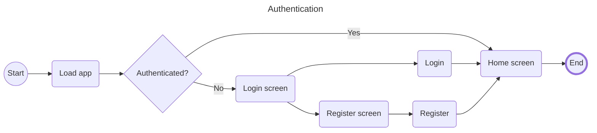
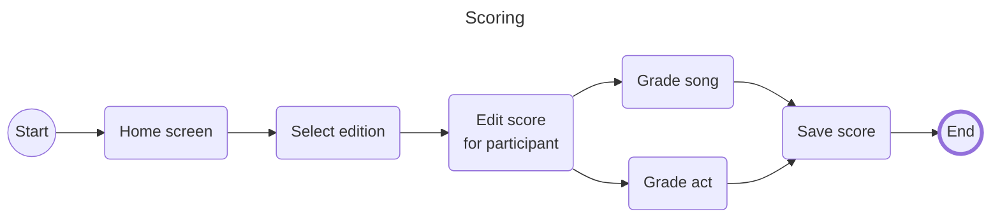
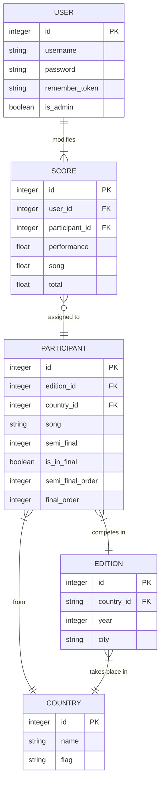

Introducing EuroScorer - a web app made for Eurovision fans that simplifies the grading process of Eurovision songs! Designed with the user in mind, EuroScorer allows you to assign scores to Eurovision entries and automatically organizes them.

With its modern interface, EuroScorer makes assigning scores to Eurovision acts an effortless task. Simply register on the app, select the participant you want to grade, and give a score for the song and the performance. The app instantly updates your scores, and shows your top 10 semi-finalists or your top 5 finalists.

EuroScorer has a sleek dark mode option, allowing you to enjoy optimal viewing conditions according to your preference!

Access EuroScorer from any device, and enjoy the perfect companion while watching Eurovision. But that's not all - EuroScorer also provides detailed statistics, such as the average highest and lowest rated songs across the user base. These insights can help users gain a deeper understanding of what other Eurovision fans think of the entries. Join the EuroScorer community today and experience Eurovision grading like never before!

# App flow

# Database

# Maintaining the app

To add or modify countries, editions, and participants, you can edit their corresponding seeder files located in `/database/seeders`. Once you have made the necessary changes, apply them to the database by running `php artisan db:seed`. 

In the V2 release, an admin panel will be introduced to make data modification more easily accessible.

## Adding a test user

Additional user and score seeders are available if you need to add a test user. To seed a new user, simply take the following steps:

- Run `php artisan db:seed --class=UserSeeder` to add the test user.

- Run `php artisan db:seed` to update the participants and add a score entry for the test user.

## Instructions for setting up a new site on a subdomain on the server

  

These instructions assume that you are using a Hetzner Ubuntu server and have already registered the domain name `584791601.xyz` with Namecheap. They also assume that you are using the Laravel Framework for your application.

  

### Logging in to the Hetzner Ubuntu server

  

Refer to the "Image editor" document for the login credentials to the Hetzner Ubuntu server.

1. Open a command prompt interface

2. Run `ssh [user]@[host]` to connect to the server.

  

### Cloning the repository

  

1. Go to the `/var/www` directory.

2. Run `ls -la` to see the existing directories.

3. Create a new directory (e.g., `html3`).

4. Navigate to the new directory using `cd`.

5. Clone the repository using https authentication and a personal access token. Refer to the "Image editor" document and GitHub developer settings for instructions.

  

### Hosting

  

1. Go to `/etc/apache2/sites-available`.

2. Copy the default virtual host configuration (`cp 000-default.conf`) to a new file.

3. Open the new file using `sudo nano`, and change:

-  `/var/www/html/customizer/public/` to the `public` directory of the cloned repository.

- Remove all rewrites (`RewriteEngine` through `RewriteRule`). These will be generated later by certbot when creating an SSL certificate.

4. Save the file with the name `[app name].584791601.xyz.conf`.

5. Restart the server using `sudo systemctl reload apache2`.

  

### DNS

  

1. Open the [Hetzner DNS Console](https://dns.hetzner.com/).

2. Click on the zone for the `584791601.xyz` domain name.

3. Add a new record with the following values:

- Type: A

- Name: `[app name]`

- Value: IP address of the server (same as the IP address for `@` and `www`).

- TTL: 300 It may take some time for the DNS to propagate.

  

### SSL

  

The next step is to create an SSL certificate using certbot. This will secure the application via HTTPS.

  

1. Run the command `certbot` to start the certbot set-up.

2. Press Enter to select all domains.

3. Keep the existing RSA certificates.

4. Expand the existing certificates with the new certificate.

  

### MySQL

  

1. Run the command `sudo mysql` or log in with an existing user.

2. Follow these steps to create a new database:

-  `CREATE DATABASE [database name];`

-  `CREATE USER '[database name]'@'localhost' BY '[16-character password]';`

-  `GRANT ALL PRIVILEGES ON [database name].* TO [database name]@localhost;`

  

### Building

### Local

1. Open Docker Desktop

2. In a terminal run `wsl` to open WSL 2.

3. In WSL 2, go to the project directory and run `.vendor/bin/sail up` to start the Docker container.

4. Open a new terminal, go to the project directory and run `npm run dev` to build the project.

### Production
  

1. Open the app directory at `/var/www/[html directory]/[app name]`.

2. Copy the `.env.example` file using `cp .env.example .env`.

3. Update the app and database variables in the `.env` file.

4. Run `composer install`.

5. Run `php artisan migrate`.

6. Run `php artisan storage:link`.

7. Run `php artisan cache:clear`.

8. Run `php artisan route:cache`.

9. Run `npm install`.

10. Run `npm run build`.

#### Releasing

To deploy a new release on the production environment, go to the `/var/www/[html directory]/[app name]` directory and run the following commands:

1. `sudo git pull` - this will prompt you for a sudo password and GitHub credentials

2. `composer install`

3. `php artisan migrate`

4. `php artisan db:seed --class=UserSeeder`

5. `php artisan db:seed`

6. `php artisan db:seed --class=ScoreSeeder`

7. `npm install`

8. `npm run build`

In V2 this release strategy will be automated using a continuous delivery pipeline.
